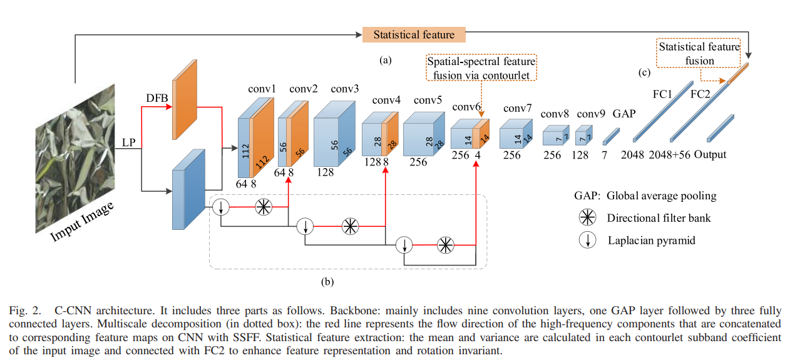
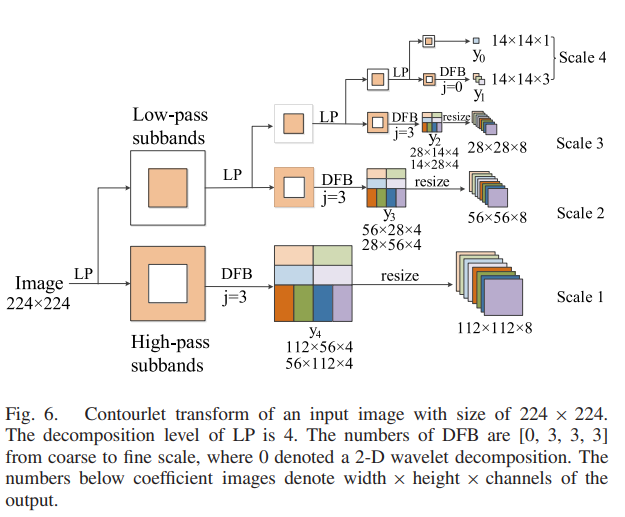
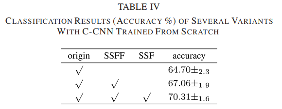
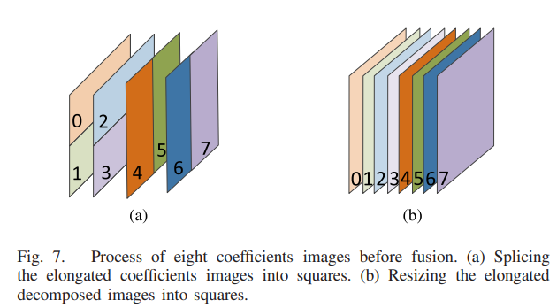

# C-CNN: Contourlet Convolutional Neural Networks
This repo implemenets the Contourlet-CNN as described in [C-CNN: Contourlet Convolutional Neural Networks](https://ieeexplore.ieee.org/document/9145825), using PyTorch, Numpy and Cython.



For texture classification, spectral analysis is traditionally employed in the frequency domain. Recent studies have shown the potential of convolutional neural networks (CNNs) when dealing with the texture classification task in the spatial domain. This network combines both approaches in different domains for more abundant information and proposed a novel network architecture named contourlet CNN (C-CNN). This network aims to learn sparse and effective feature representations for images. First, the contourlet transform is applied to get the spectral features from an image. Second, the spatial-spectral feature fusion strategy is designed to incorporate the spectral features into CNN architecture. Third, the statistical features are integrated into the network by the statistical feature fusion. Finally, the results are obtained by classifying the fusion features. 

## Installation
The code is tested in a Conda environment setup. First, install PyTorch, torchvision and the appropriate version of cudatoolkit. The code is tested with torch=1.9.1 and torchvision=0.10.1.
```
conda install pytorch torchvision cudatoolkit=11.1 -c pytorch -c conda-forge
```
Next, install the other supporting packages from the `requirements.txt` provided.
```
pip install -r requirements.txt
```
You should be able to run the notebooks provided after the setup is done.

## Code and Notebooks
In this repo, two Jupyter notebooks is provided.
1. `01_Visualize_Contourlet_Transform.ipynb` - Visualize the contourlet transform output of a sample image, as described in the paper.



2. `02_Training_DEMO.ipynb` - A minimal example of training a Contourlet-CNN on the CIFAR-10 dataset. 

The `pycontourlet` folder contains a modified version of the [pycontourlet](https://github.com/mazayux/pycontourlet) package from [mazayux](https://github.com/mazayux). Unlike the original, this version works on Python 3.

The `contourlet_cnn.py` contains the class definition for the Contourlet-CNN network.

## Network Variants



The variants of the Contourlet-CNN model. From left to right, each variant is an incremental version of the previous variant, as such in an abalation study in the original paper.
- ``"origin"`` - The 'origin' splices the elongated decomposed images into its corresponding sizes since the contourlet has elongated supports. No SSF features is concatenated to the features in FC2 layer.
- ``"SSFF"`` - Instead of splicing, the 'SSFF' (spatial–spectral feature fusion) via contourlet directly resize the elongated decomposed images into its corresponding sizes. No SSF features is concatenated to the features in FC2 layer.
- ``"SSF"`` - In addition to 'SSFF', the 'SFF' (statistical feature fusion) that denotes the additional texture features of decomposed images, are concatenated to the features in FC2 layer. The mean and variance of each subbands are chosen as the texture features of decomposed images.
 
In  the original paper, the images are converted to grayscale image before feeding into the network. This implementation supports both grayscale images and images with full RGB channels. By setting the `spec_type` parameter, For full RGB channels, use `"all"`, while to use grayscale images, use `"avg"`.

Examples:
```
# Uses all RGB channel for contourlet transform, the output are resized, and the statistical
# features are concatenated to the FC layer. This is the recommended variant.
model = ContourletCNN(input_dim=(3, 224, 224), num_classes=10, variant="SSF", spec_type="all")

# Uses only the grayscale channel for contourlet transform, the output are resized, and the 
# statistical features are concatenated to the FC layer.
model = ContourletCNN(input_dim=(3, 224, 224), num_classes=10, variant="SSF", spec_type="avg")

# Uses all RGB channel for contourlet transform, the output are spliced
model = ContourletCNN(input_dim=(3, 224, 224), num_classes=10, variant="origin", spec_type="all")

# Uses all RGB channel for contourlet transform, the output are resized
model = ContourletCNN(input_dim=(3, 224, 224), num_classes=10, variant="SSSF", spec_type="all")
```
